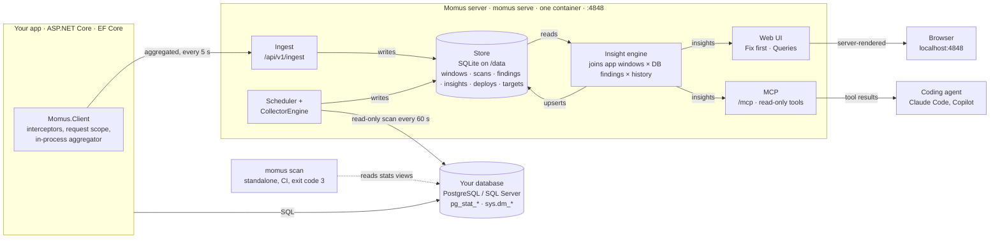

# Momus 1.0 design

*Proposed 6 September 2026. Builds on collector core 0.x (CLI, Postgres, SQL Server). A rendered copy of this document exists as a Claude artifact; this file is the source of truth.*

One package in the app, one container beside the database, one page that says what to fix first and where in the code it lives.

## What 1.0 is

Momus 0.x reads a database's own statistics views and produces prioritized findings. It sees the database and nothing else. Momus 1.0 adds the other half: a small client inside the .NET application that records which handler ran which query, how many times per request, from which line of code, and how long a transaction or a connection was held. A server joins the two sides and keeps history, so it can also say what changed since the last deploy.

The product rule for every feature: a general AI can already explain what a sequential scan or an N+1 is. Momus exists to answer the question the AI cannot see: *which of my endpoints has one right now, which table it hammers, and did it start with the last deploy.* Anything that only restates what the database already says is a lower priority than anything that joins the two sides.

### The three insights 1.0 is built around

| Insight | App side supplies | DB side supplies | Join key | Needs history |
| --- | --- | --- | --- | --- |
| **N+1 with real cost** `n_plus_one` | Queries per operation, max repeats of one fingerprint per request, call site | Scan type on the table, mean time, index presence | Query fingerprint, table name | No |
| **Expensive query mapped to code** `hot_query_origin` | Operation, call site, calls per minute per fingerprint | Top queries by total time or CPU from `pg_stat_statements` / `dm_exec_query_stats` | Query fingerprint | No |
| **Regression since deploy** `regression` | App version per window, per-fingerprint timing | Per-scan findings and query stats | Fingerprint plus app version | Yes |

Two more follow once these work: transactions held open while doing non-database work, and connection pool waits attributed to an operation.

## System



Two collectors, one store, one engine. The client never talks to the database on Momus's behalf and the server never sees a raw literal. The CLI path is today's product and stays unchanged.

**One binary, two modes.** `momus scan` stays the standalone CI tool. `momus serve` is the same executable running the server. The Docker image is nothing more than the CLI with `serve` as its entrypoint. One build, one version number, one changelog.

## Packages and repo

| Project | Ships as | License | Role | Status |
| --- | --- | --- | --- | --- |
| `Momus.Core` | NuGet | Apache-2.0 | Models, engine, **shared SQL fingerprint**, insight contracts | Exists, grows |
| `Momus.Postgres`, `Momus.SqlServer` | NuGet | Apache-2.0 | Scan targets and DB-native checks | Exist, findings gain subjects |
| `Momus.Client` | NuGet | Apache-2.0 | ASP.NET Core request scope, EF Core interceptors, aggregator, exporter | New |
| `Momus.Client.Switchboard`, `Momus.Client.MediatR` | NuGet | Apache-2.0 | One pipeline behavior each that names the current operation for non-HTTP work | Later, optional |
| `Momus.Server` | Inside the CLI | FSL-1.1-ALv2 (proposed, decision D3) | Ingest, scheduler, SQLite store, insight engine, web UI, MCP | New |
| `Momus.Cli` | Docker image, dotnet tool `Momus` | FSL-1.1-ALv2 (proposed), because the binary contains the server | `scan`, `serve`, `report`, `mcp` | Exists, gains commands |

Multi-target the client the way Switchboard does, net8.0 through net10.0, because the client has to live inside other people's apps. The server and CLI target the latest runtime only.

Switchboard itself is not touched. Its promise is a few hundred lines and one dependency; the adapter above is ten lines that belong in Momus's repo.

### One repository

Momus stays one repo with one version number. One tag publishes every NuGet package, the dotnet tool and the Docker image together, so `Momus.Client` 1.3 is known to talk to server 1.3 and the ingest contract needs no compatibility matrix. Libraries that other people's code links against are Apache 2.0; the executable, which contains the server, is proposed to be under the Functional Source License. Mixed licensing lives in one tree: a root `LICENSE` naming which directories fall under which terms, a license file inside each project, and the license expression set per package.

```
momus/
  LICENSE                 which directory is under which terms
  LICENSE-APACHE          full text
  LICENSE-FSL             full text (only if D3 goes that way)
  Directory.Build.props   one version for everything
  src/Momus.Core          Apache-2.0
  src/Momus.Postgres      Apache-2.0
  src/Momus.SqlServer     Apache-2.0
  src/Momus.Client        Apache-2.0
  src/Momus.Server        FSL-1.1-ALv2 (proposed)
  src/Momus.Cli           FSL-1.1-ALv2 (proposed), Dockerfile lives here
  samples/Shop.Api        demo app with a deliberate N+1
  tests/                  unit, integration, fingerprint fixtures
  benchmarks/             client overhead, numbers printed into the README
  docs/                   DESIGN.md (this), PLAN.md
```

Split only if the client's release cadence ever diverges from the server's, or an outside contributor base forms around one part and not the other.

## Client

One line in `Program.cs`: `builder.Services.AddMomus();`. No middleware call, no interceptor registration, no attributes on queries. The client registers an `IStartupFilter` that inserts its request middleware first, and hooks every `DbContext` so interceptors are added without the user naming a context (mechanism to verify; see PLAN.md open questions).

### What it records

| Signal | Source | Aggregation key | Kept per key |
| --- | --- | --- | --- |
| Operation | Endpoint display name or route pattern; falls back to `Activity.Current`; explicit `Momus.Operation("ImportJob")` for background work | operation | count, duration sum/max, queries per op sum/max, DB ms sum |
| Query | `DbCommandInterceptor` reader, non-query and scalar events | fingerprint × operation × call site | count, duration sum/max, log2 histogram, rows, max repeats in one op, errors |
| Transaction | `IDbTransactionInterceptor` started, committed, rolled back | operation × call site | count, open ms sum/max, DB ms inside sum |
| Pool wait | `IDbConnectionInterceptor` opening to opened | operation | count, wait ms sum/max |
| Deploy | Entry assembly informational version, host, process start | app × version | first seen, last seen |

### Call site without asking the user for tags

The first time a fingerprint and operation pair is seen in a process, the interceptor captures a stack trace, keeps the first frame outside `Microsoft.*` and `System.*`, and caches it. Every later execution costs a dictionary lookup. That gives `OrdersHandler.cs:42` for free in Development; in Production the same first-seen rule applies, so the cost is bounded by the number of distinct pairs, not by traffic. If the user already uses EF Core's `TagWithCallSite`, the tag wins.

### Fingerprint

Both sides must derive the same key from different texts: the app sees `WHERE "Id" = @p0`, Postgres stores `WHERE "Id" = $1`, SQL Server stores the statement slice from `dm_exec_sql_text`. One normalizer lives in `Momus.Core` and is used by the client and by the server's scan path.

```
SqlFingerprint.Compute(sql):
  1. strip comments; if an EF tag comment is present, remember it as call site
  2. collapse whitespace to one space, trim
  3. replace numeric and quoted literals with ?
  4. replace parameter markers (@p0, $1, :p1, ?) with ?
  5. collapse IN (?, ?, ?) and VALUES (...), (...) to a single group
  6. lowercase keywords only; identifiers keep their case
  7. key = first 16 hex chars of SHA-256(normalized)
```

Tests ship with real pairs, one column captured from the app and one from the statistics view, and assert the keys match. Postgres also stores its own `queryid` beside the key so the DB side keeps its native identity.

### Privacy and cost rules

- **No literals leave the process.** Only the normalized sample text is sent. Parameter values and result rows are never read.
- **Bounded memory.** At most 2,000 aggregate keys per window; overflow goes into one counter the UI shows as "unattributed".
- **Overhead budget.** Under one percent CPU and under five megabytes at 1,000 queries per second, verified by a BenchmarkDotNet project that runs in CI and prints its numbers into the README.
- **Off by default outside Development.** Turning it on in Production is one setting, and the connection string is only shared with a loopback server unless a second setting says otherwise.
- **Never blocks the app.** The exporter is a background channel; a dead server means dropped windows and one warning log line, not a slow request.

### Ingest contract

```json
POST /api/v1/ingest
{
  "app":     { "name": "Shop.Api", "version": "1.4.2+3f1c9d", "instance": "web-01:4412", "environment": "Development" },
  "window":  { "from": "2026-09-06T10:15:00Z", "to": "2026-09-06T10:15:05Z" },
  "targets": [ { "id": "shop", "provider": "postgres", "database": "shop", "connectionString": "Host=localhost;..." } ],
  "operations": [
    { "name": "GET /orders/{id}", "kind": "http", "count": 120,
      "durationMs": { "sum": 9120, "max": 410 }, "queries": { "sum": 4920, "max": 41 }, "dbMs": { "sum": 6300 } }
  ],
  "queries": [
    { "key": "9f3a1c77d02b4e10", "target": "shop", "operation": "GET /orders/{id}",
      "callSite": "Handlers/OrdersHandler.cs:42",
      "sample": "select ... from order_lines where order_id = ?",
      "count": 4800, "durationMs": { "sum": 8640, "max": 31, "hist": [0,12,3900,880,8,0,0,0] },
      "rows": 19200, "maxRepeatsPerOperation": 40, "errors": 0 }
  ],
  "transactions": [ { "operation": "POST /checkout", "callSite": "CheckoutService.cs:88", "count": 30,
                      "openMs": { "sum": 24600, "max": 1900, "hist": [...] }, "dbMs": { "sum": 720 } } ],
  "pool": [ { "operation": "GET /orders/{id}", "waits": 12,
              "waitMs": { "sum": 940, "max": 210, "hist": [...] } } ],
  "client": { "version": "0.3.0", "dropped": 0 }
}
```

The histogram is twelve log2 buckets starting at 1 ms, enough for a p95 without shipping raw samples. `openMs` and `waitMs` carry one for the same reason `durationMs` does: the rules that read them are percentiles, and a sum and a maximum cannot produce one. Version 1 of the contract is frozen at 1.0; new fields are additive.

`client` is the client's report on itself — which build is running, and how many finished operations it threw away rather than make a request wait. Instrumentation that quietly loses data is worse than instrumentation that says so, and the application's own log is the wrong place to say it: the person looking at Momus is not tailing the app.

## Server and store

An ASP.NET Core minimal API, hosted by the CLI. Four jobs: accept windows, scan targets on a schedule with the existing `CollectorEngine`, run the insight engine, serve the page and the MCP endpoint. State is one SQLite file on a volume. There is no second database to back up, migrate or secure.

### Targets

A target is a database the scheduler scans. It arrives one of three ways: the client's hello, an environment variable, or the Settings tab. When a client running on the host hands over a connection string that says `localhost`, the server inside Docker tries it, and on failure retries with `host.docker.internal` before giving up. That one retry removes the most common first-run failure.

### Tables

| Table | Holds | Notes |
| --- | --- | --- |
| `apps`, `app_instances` | Name, version, host, first and last seen | A new version on an app is a deploy marker |
| `targets` | Provider, database, connection string, source | Connection string stored as given; the volume is the trust boundary |
| `scans`, `check_results`, `findings`, `finding_subjects`, `finding_state` | Today's `ScanReport`, persisted, plus per-finding lifetime | Subjects are first-class columns for joins |
| `windows`, `query_stats`, `operation_stats`, `transaction_stats`, `pool_stats` | Ingested aggregates, one row per key per window | Rolled up to hourly rows after 24 hours |
| `query_texts` | Fingerprint, normalized sample, native query id | One row per key per target |
| `insights` | Kind, severity, title, detail, recommendation, evidence, subjects, first seen, last seen, status | Upserted by stable key so an insight has a lifetime and can be muted or marked fixed |

### Retention

Raw five-second windows are kept for 24 hours, hourly rollups for 7 days in the free tier. Scans are kept as long as the rollups. A nightly job trims the file and runs `VACUUM`. The Pro tier changes the two numbers and nothing else.

## Insight engine

Today's `IDiagnosticCheck` takes an open connection and reads statistics views. That contract stays exactly as it is. Insights are a second kind of check that never touches a database: they read the store. Keeping the two apart means the collector core stays testable with a fake connection, and insights are testable with an in-memory store.

```csharp
public interface IInsight
{
    string Kind { get; }                       // "n_plus_one", "regression", ...
    Task<IReadOnlyList<Insight>> EvaluateAsync(IInsightContext ctx, CancellationToken ct);
}

// IInsightContext is a snapshot of one database over one stretch of time, loaded before any rule
// runs — not a set of queries a rule may issue. That makes a rule a pure function of its inputs,
// and stops two rules disagreeing about what the numbers were mid-evaluation:
//   TargetId, Now, Since        -> a rule takes time from here, never from the clock
//   LatestFindings              -> the newest scan's findings, each with its first-seen date
//   QueryStats                  -> per key × operation × call site, with rates over Since..Now
//   OperationStats              -> per named operation
// M3 adds the reads its own rules need — timings by app version, transactions, pool waits.
```

### Rules for 1.0

| Kind | Fires when | Joined evidence | Severity |
| --- | --- | --- | --- |
| `n_plus_one` | One key repeats 5 or more times inside a single operation **and** runs at least 60 times a minute — a shape and a cost, because neither alone is worth an afternoon | DB finding on the same key or on its table: seq scan, mean time, missing index | Medium alone, High if the DB side says the table is scanned or the query is slow |
| `hot_query_origin` | A key is in the top 10 of the DB's top-queries findings by total time. The scan keeps 50 so the Queries tab can join any of them; 50 cards is a list nobody reads | Operation, call site, calls per minute from the app. If no app has sent this key, the insight says so: it comes from a job, a migration or another app | Inherits the DB finding's severity |
| `regression` | Mean time for a key under the newest app version is more than 3× the previous version's and at least 20 ms slower, with 100 or more calls on each side | Both versions' timings, the DB finding for the key, and any DB finding that appeared between the two deploys | High, Critical above 10× |
| `transaction_held_open` | p95 open time above 500 ms and DB time inside below 30 percent of it, over at least 20 transactions | DB side: idle-in-transaction sessions, blocking chains | Medium, High when the DB side is reporting idle or blocked sessions |
| `pool_wait` | p95 wait above 100 ms over at least 20 acquisitions | DB side: connection saturation; app side: operations with the longest open transactions | Medium, High when the DB is saturated |
| `db_finding` | Any DB-native finding that is not about a single statement — `hot_query_origin` owns those and says strictly more about each, so two rules never produce two cards for one finding | First seen, last seen, and the app operations that touch its subject | As produced by the check |

### Ranking

One score decides what sits in the five "Fix first" slots: severity weight, times the share of app traffic that hits the subject, times a recency factor that favours things that started in the last 24 hours. A Critical that nothing calls loses to a High on the busiest endpoint.

The traffic share is the **widest** of an insight's subjects, not the sum of them: an unused-index finding carries both `index:` and `table:`, and adding them up scored every multi-subject insight as if it were about the whole application. Only `server` and `database` mean "all of it"; an index or a session has no traffic of its own, so the table it sits on is what scales it.

Muted insights are shown only on the Insights tab, which is where the button that undoes it lives — filtering them everywhere makes muting a one-way door. A fixed insight that fires again reopens itself and is marked as having done so, because "the fix did not hold" is a different thing from "nobody has looked at this yet".

## The one page

Server-rendered Razor with htmx for the drawer and the refresh, inline SVG sparklines, no Node toolchain. It has to feel like the Aspire dashboard or Seq: open the port, see the answer.

- **Header.** App name and version, target name and server version, last scan and last window age. A version changing in the header is a deploy. A stale window is a visible amber pill, because "the client is not sending" is the first-run problem.
- **Fix first.** Five cards. Each has a title in plain language, one line of why, a call-site chip, a DB-evidence chip, a 24-hour sparkline and three actions: Copy evidence pack, Mute, Details.
- **Evidence pack.** Markdown on the clipboard: the insight, both sides' numbers, the normalized query, the deploy versions. Written to be pasted into a coding agent.
- **Tabs.** Fix first is the home page. Then Insights, Queries, History, Findings, Settings, Diagnostics. Findings is today's console report, kept as a tab so nothing the collector produces is hidden behind an interpretation of it. Diagnostics was not in the original list and earned its place: a two-sided tool fails silently, and every one of those failures looks exactly like "nothing to report" on all the other tabs.

### The Queries tab

The product's signature: the app's view and the database's view of the same statement, side by side, on one row.

| Query | Operation | Call site | Calls/min | App mean ms | DB mean ms | Database says | Insight |
| --- | --- | --- | ---: | ---: | ---: | --- | --- |
| `select … from order_lines where order_id = ?` | `GET /orders/{id}` | `OrdersHandler.cs:42` | 4,800 | 1.8 | 1.1 | Seq scan, 1.2 M rows, no index on `order_id` | High: N+1, ×40 per request |
| `select … from products where lower(name) like ?` | `GET /search` | `SearchQuery.cs:17` | 120 | 640 | 612 | #1 by total time, 78 s over the last hour | High: hot query |
| `update carts set … where id = ?` | `POST /cart/items` | `CartService.cs:88` | 300 | 4.2 | 2.0 | Index scan, healthy | Info |
| `select … from audit_log where created_at > ?` | *not seen from any app* | — | — | — | 2,300 | #2 by total time | Medium: origin unknown, likely a job |

Example rows. The fourth row is a feature, not a gap: a query the database is spending time on that no instrumented app sent is worth knowing about.

### Empty state

The page at first launch teaches instead of apologising. Three lines, each with a copy button: add the package, add the one line, hit some endpoints. Under it, "Scanning shop on localhost every 60 s, last scan 12 s ago, 3 findings" so the DB half is visibly alive while the app half is not yet.

## MCP and CLI

**MCP tools, all read-only**, served on `/mcp` over streamable HTTP with the official C# SDK, plus `momus mcp` as a stdio bridge:

- `momus_top_insights(limit)`: the Fix first list with evidence packs
- `momus_query(key)`: both sides' numbers and history for one fingerprint
- `momus_findings(target)`: the latest DB-native scan
- `momus_operation(name)`: everything an endpoint does to the database
- `momus_since_deploy(version)`: what changed after a version first appeared

**CLI commands:**

- `momus scan`: unchanged, exit code 3 on High or Critical
- `momus serve`: the server, what the container runs
- `momus report --json in.json --html out.html`: a self-contained audit page from a scan
- `momus mcp --server http://localhost:4848`: stdio bridge

Also published as a dotnet global tool: `dotnet tool install -g Momus`.

## Config and Docker

| Setting | Default | Why that default |
| --- | --- | --- |
| `Momus:Enabled` | true in Development, false otherwise | Zero surprises in Production |
| `Momus:Endpoint` | `http://localhost:4848` | Same convention as Seq and Jaeger; one port to remember |
| `Momus:ShareConnectionStrings` | true when Endpoint is loopback | Configure the database once, on the app side, in dev |
| `Momus:FlushSeconds` | 5 | Feels live; still hundreds of times fewer requests than a tracer |
| `Momus:AppName` | Entry assembly name | Nothing to type |
| `MOMUS_DATA` | `/data` | One volume to mount |
| `MOMUS_SCAN_INTERVAL` | `60s` | Statistics views are cheap to read; a minute keeps sparklines useful |
| `MOMUS_TARGETS__0__*` | none | For servers that get no client, such as a staging DB |
| `MOMUS_LICENSE` | none | Pro key, validated offline |

```
docker run -d --name momus -p 4848:4848 -v momus-data:/data ghcr.io/software-first-gr/momus
```

Base image `mcr.microsoft.com/dotnet/aspnet:10.0-alpine`, published framework-dependent, well under 150 MB. The free build binds to all interfaces with no authentication, so the README says in its first screen: put it behind your own proxy if it leaves your machine. Pro adds a login.

## Changes to today's code

- **`Finding` gains `Subjects`.** A short list of typed keys such as `query:9f3a1c77d02b4e10`, `table:public.order_lines`, `index:ix_orders_status`. The insight engine joins on these instead of parsing `Evidence`. Every existing check sets at least one.
- **`SqlFingerprint` moves into Core.** The Postgres and SQL Server top-queries checks compute it from the statistics-view text and put it in `Subjects`.
- **Top-queries checks return more rows to the store than to the console.** The check takes a limit; the CLI passes five, the server passes fifty.
- **`ScanReport` is unchanged** and gets a persister. The JSON export of the CLI stays byte-compatible so existing CI scripts keep working.
- **`Momus.Cli` becomes a multi-command host** using the same option parsing it has now. `scan` keeps its flags and exit codes.

## Milestones

See `docs/PLAN.md` for the task-level plan. Summary:

| | Name | Done when |
| --- | --- | --- |
| M1 | Serve and remember | Run beside your own database for a week; see a finding with a first-seen date the CLI could not give. |
| M2 | The other side | The top pg_stat_statements query on your own project shown with a file and line; one unknown N+1 found. |
| M3 | Time and blame | A deliberately slowed query in a new build is flagged with the version name within two minutes. |
| M4 | Meet the user where they are | A coding agent answers "what is wrong with my database" from Momus's evidence; twenty strangers have run the container. |
| M5 | Pro | The first stranger pays. Not before M4 has users. |

## Free and Pro line

Never gate what one developer needs to trust the tool. Gate what a team needs to keep it running. Every check, every insight and the MCP endpoint are free forever.

| Capability | Free | Pro |
| --- | --- | --- |
| Checks, insights, Queries tab, evidence packs, MCP, CLI | All | All |
| Apps and targets per server | 1 app, 1 target | Unlimited |
| History | 24 h raw, 7 days hourly | Configurable, years |
| Regression detection | Within the 7-day window | Across the full history |
| Alerts | None | Slack, email, webhook on new High or Critical |
| Login and users | None, bind behind your proxy | Built in |
| Audit report | Momus-branded HTML | White-label, PDF |

## Non-goals and risks

**Not in 1.0:** OTLP ingestion (right long-term wire format, large surface; internal `Activity` use keeps the door open). Dapper and raw ADO.NET capture (later, via Npgsql's and SqlClient's activity sources). MySQL. A hosted version. Charts for their own sake.

**Risks and the answer to each:**

- **Fingerprints that do not match** between app text and statistics-view text. Fixture tests with real pairs from day one, and a fallback match on the table set plus the first 64 normalized characters.
- **EF Core version matrix.** Multi-target 8, 9 and 10, test all three in CI, exactly the Switchboard playbook.
- **Overhead fear.** Publish the benchmark numbers in the README and keep the first-seen rule for stack captures.
- **Dashboard fatigue.** Five cards, not a wall of charts. If the page needs a scroll bar to find the answer, the ranking is wrong.
- **Solo maintenance.** One binary, one store, no frontend build. Every choice above was made to keep the thing runnable by one person for years.
